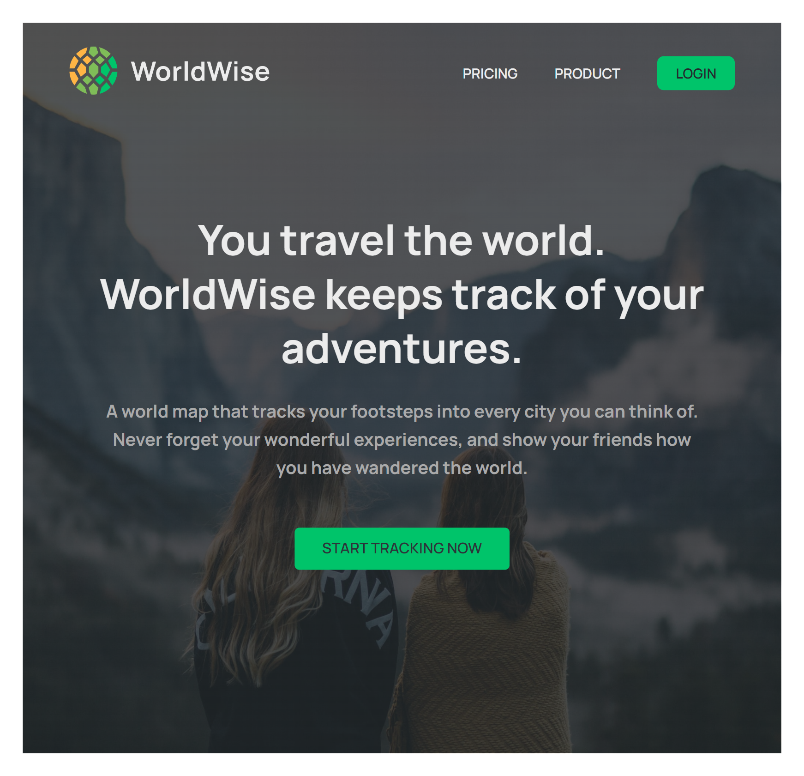

# 🌍  WorldWise-History-of-Travel 🌐

Explore the world's travel history and get hands-on with cities, countries, and your own personal journey on our interactive map! 🗺️

## 🚀 Key Features

1. 🗺️ **Map with Your Mark:** Use our map to mark the places you've been, adding your personal touch to the world's travel history.

2. 📆 **Journey through Time:** Discover travel stories from different times and learn about the adventures of explorers and travelers.

3. 🌆 **City Insights:** Get to know cities better. Learn about their culture, landmarks, and what makes them special.

4. 🌎 **Country Exploration:** Dive into countries' histories and their contributions to the world of travel.

5. 🔐 **Simple Authentication:** Test features safely with fake authentication. No real usernames or passwords needed.

Join our Travel History Project for a fun and educational exploration of the world's travel past. Whether you're a history enthusiast, an explorer, or just curious, come along for the ride! 🌏🚶‍♂️🔍🔐

## React + Vite

This template provides a minimal setup to get React working in Vite with HMR and some ESLint rules.

Currently, two official plugins are available:

- [@vitejs/plugin-react](https://github.com/vitejs/vite-plugin-react/blob/main/packages/plugin-react/README.md) uses [Babel](https://babeljs.io/) for Fast Refresh
- [@vitejs/plugin-react-swc](https://github.com/vitejs/vite-plugin-react-swc) uses [SWC](https://swc.rs/) for Fast Refresh

  

.png)

